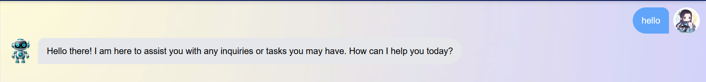
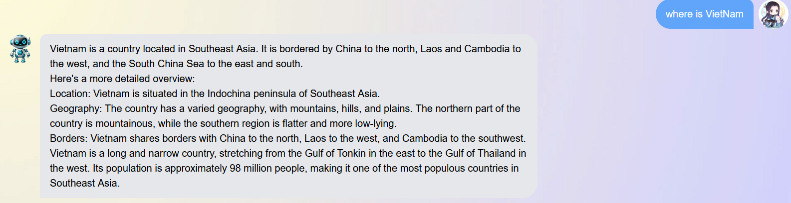
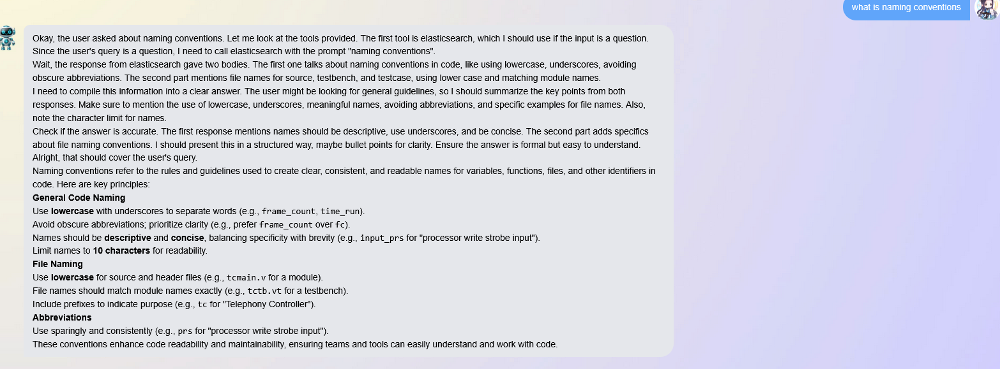
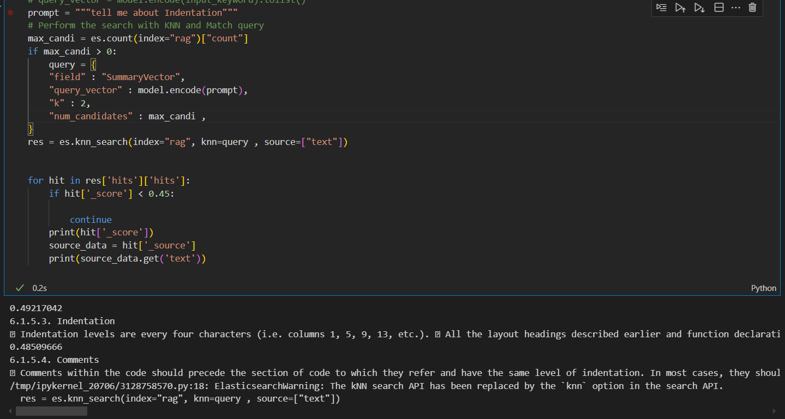

# VeronChatBot

<b>System Desgin:</b>


<b>Run Repo:</b>

Tải Ollama 

https://ollama.com/download/windows

Mở terminal: ollama pull llama3.2:1b

```
cd webapp
docker compose up --build
cd frontend
npm install
npm run dev
cd ../backend
pip install -r requirements.txt
python main.py 
```

<b>Chatbot Function:</b>

<i>Normal Greeting:</i>


<i>Duckduckgo Search:</i>


<i>RAG with Elasticsearch:</i>



<b>Chạy các Service đặc biệt:</b>

<i>a. Elasticsearch:</i>

First I use Docling for section document chunking. The output will be list of sections. Then I summarize all the sections. Then I embed them to embedded vector and store to elasticsearch. The Elasticsearch will get the content of section base on similarity between query and summarized embedded vector. You can test the module in elastic/indexData.ipynb and gerate_qa/docling.ipynb.




<i>b. Nginx:</i>

If you want to run all using Docker,
```
cd webapp
docker compose up --build -d
```

In there, the Nginx will be available, you can use port 80 or direct the ip of service to access the webpage

<i>c. Kafka:</i>

The Kafka is the another option for system scaling, I have tested it with basic model without tools, the main point of this service is that we can use Kafka broker and topic, to store the message when the traffic is heavy then inference it on another LLM inference server.